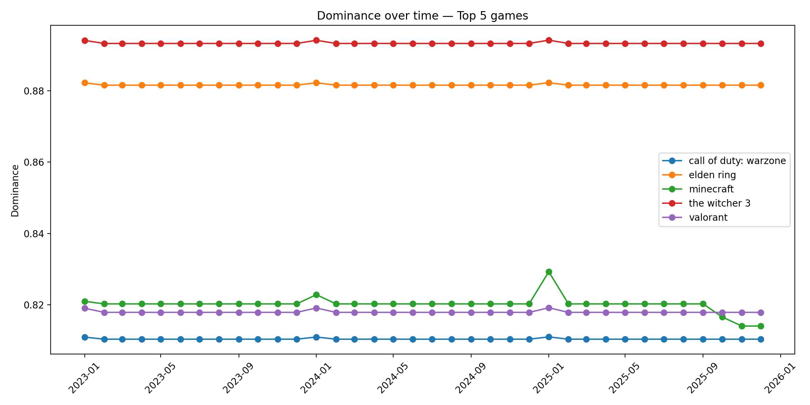
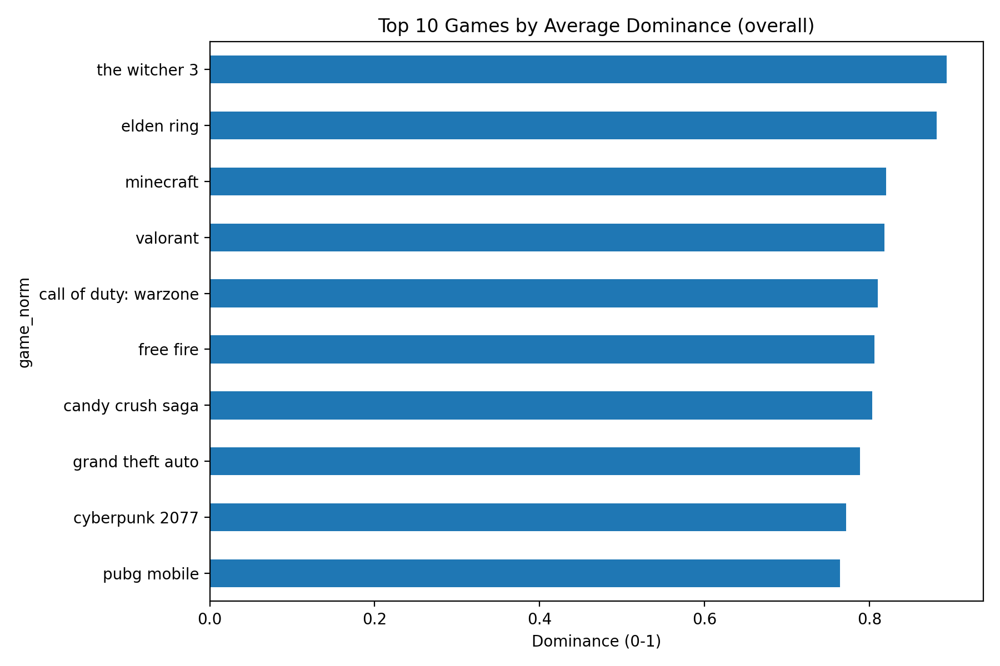
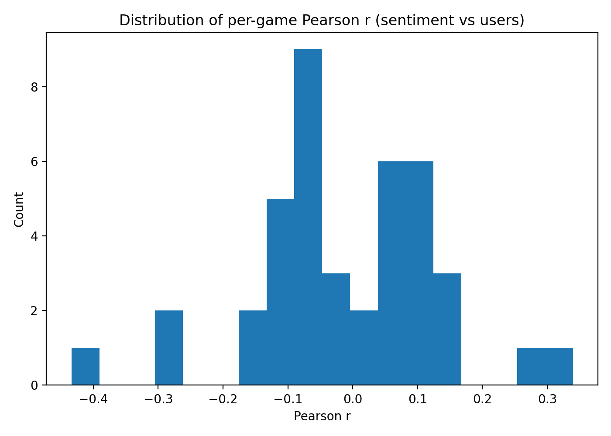
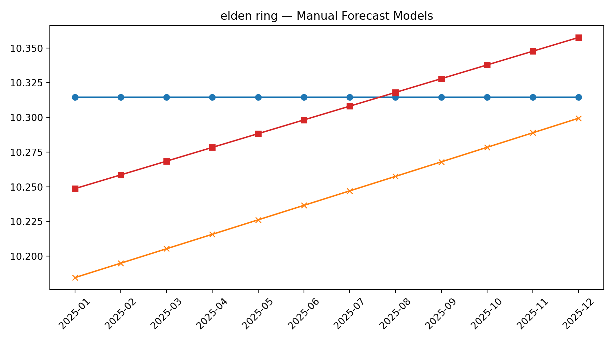
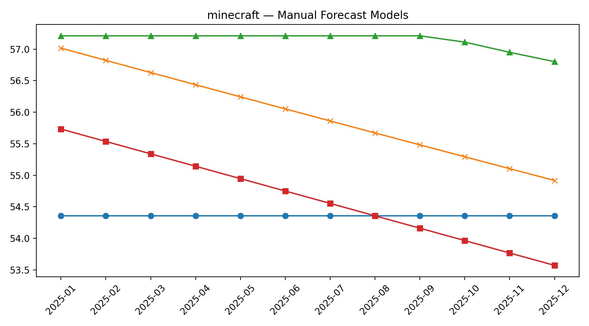
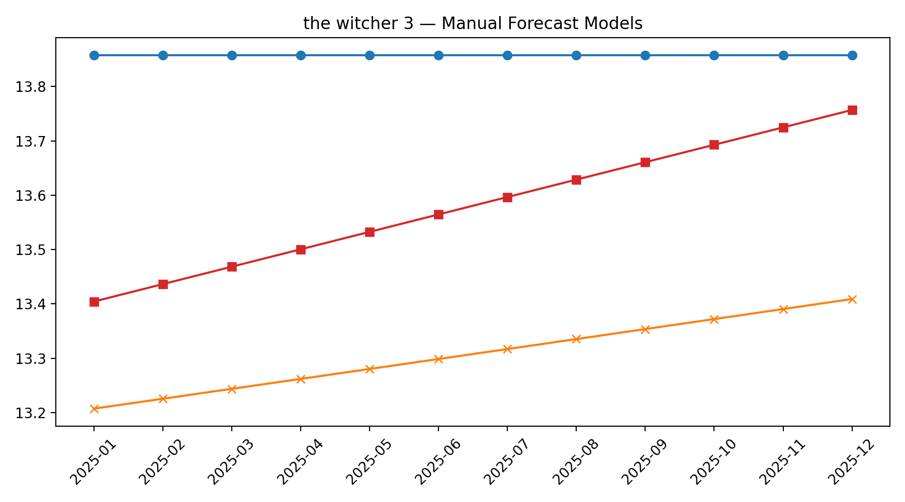
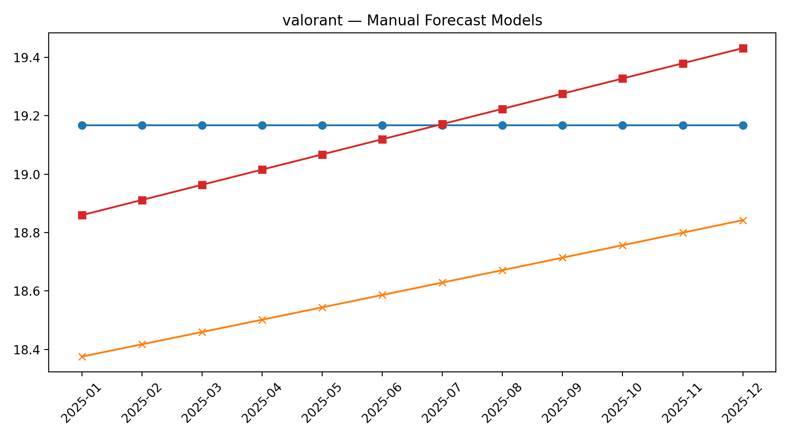

# 🎮 Gaming Sentiment, Engagement & Dominance Analysis (Python Project)

This project analyses **50 popular video games** using **Python**, performing sentiment extraction, monthly aggregation, forecasting (AR1 & ARX), and dominance scoring.  
It also includes company-level insights and forecasting comparisons.

---

## 📂 **Repository Contents**

The repository contains sentiment scripts, scrapers, forecasting models, dominance analysis, and output figures.

### **Python Scripts**
- `aggregate_monthly_sentiment_allgames.py`
- `append_cod_pubg_reviews_fixed.py`
- `baldures_gate3_steam_scraper.py`
- `calculate_sentiment_score.py`
- `company analysis.py`
- `company_and_game_summary.py`
- `company_sentiment_dominance_analysis.py`
- `elden_ring_scraper.py`
- `favourite — sentiment.py`
- `AR1_RMSE vs ARX_RMSE.py`

### **Data / Text**
- `selected 50 games.txt`

### **Images Used in Analysis**
- `Dominance_Top5_trends_FIXED.png`
- `Top10_Dominance_overall.png`
- `hist_sentiment_users_r.png`
- `elden_ring_manual_forecast.png`
- `minecraft_manual_forecast.png`
- `the_witcher_3_manual_forecast.png`
- `valorant_manual_forecast.png`

---

## 🛠 **Project Workflow**

1. **Scraping & Review Collection**
   - Scripts such as  
     `elden_ring_scraper.py`,  
     `baldures_gate3_steam_scraper.py`,  
     `append_cod_pubg_reviews_fixed.py`  
   collect Steam & Google Play reviews.

2. **Sentiment Processing**
   - `calculate_sentiment_score.py`  
     Computes sentiment using:
     - Keywords  
     - Emojis  
     - Punctuation  
     - User score (if available)

3. **Monthly Sentiment Aggregation**
   - `aggregate_monthly_sentiment_allgames.py`  
     → Produces monthly `avg_sentiment` + `review_count` per game.

4. **Dominance Score Calculation**
   - Done inside:  
     `company_and_game_summary.py`  
     `company analysis.py`  
     `company_sentiment_dominance_analysis.py`  
   - Uses normalized Revenue, Sentiment, Users, IP Strength.

5. **Forecasting**
   - Manual forecasting outputs:
     - AR(1)  
     - ARX (Sentiment + IP Strength)  

6. **Company-Level Insights**
   - Correlation of sentiment ↔ users  
   - Dominance by company  
   - Top titles by long-term performance  

---

## 📸 **Project Visualizations**

### **1. Top 5 Dominance Trends**


### **2. Top 10 Games by Dominance**


### **3. Sentiment vs User Correlation Distribution**


### **4. Forecasting Examples**
#### Elden Ring  


#### Minecraft  


#### The Witcher 3  


#### Valorant  


---

## 📊 **Repository Structure (Tree)**

```
Gaming-Project/
│── aggregate_monthly_sentiment_allgames.py
│── append_cod_pubg_reviews_fixed.py
│── baldures_gate3_steam_scraper.py
│── calculate_sentiment_score.py
│── company analysis.py
│── company_and_game_summary.py
│── company_sentiment_dominance_analysis.py
│── elden_ring_scraper.py
│── favourite — sentiment.py
│── AR1_RMSE vs ARX_RMSE.py
│── selected 50 games.txt
│── Dominance_Top5_trends_FIXED.png
│── Top10_Dominance_overall.png
│── hist_sentiment_users_r.png
│── elden_ring_manual_forecast.png
│── minecraft_manual_forecast.png
│── the_witcher_3_manual_forecast.png
│── valorant_manual_forecast.png
│── README.md
```

---

## ▶️ **How to Run**

### **1. Aggregate Sentiment**
```bash
python aggregate_monthly_sentiment_allgames.py
```

### **2. Calculate Game/Company Metrics**
```bash
python company_and_game_summary.py
python company analysis.py
```

### **3. Run Dominance & Correlation Study**
```bash
python company_sentiment_dominance_analysis.py
```

### **4. Run Forecast Comparison**
```bash
python "AR1_RMSE vs ARX_RMSE.py"
```

---

## 👩‍💻 **Developer**

**Pushpanjali Mamidakula**  
📌 Gaming Analytics | Python | Data Science  
📎 LinkedIn: *(https://www.linkedin.com/in/pushpanjali-mamidakula-160083220/)*


